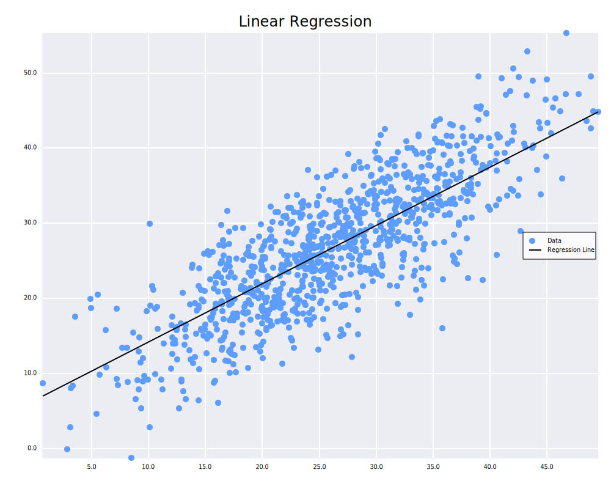

# 42 Linear Regression

The objective of this project is to develop a practical understanding of the basic concepts of linear regression and to
implement a simple linear regression model using a gradient descent approach.

## Features

- Implementation of a linear regression model
- Training the model using gradient descent
- Predicting values from the trained model
- Evaluating model performance (MAPE)
- Model visualization on a graph

## Usage

The project is divided into 2 binaries: one for training a model by taking a dataset as input, and another for using the
trained model to make predictions.

### train

```
Usage: train [OPTIONS] <DATASET_PATH>

Arguments:
  <DATASET_PATH>  CSV dataset

Options:
  -o, --output-model-path <OUTPUT_MODEL_PATH>
          Output model path [default: linear_model.csv]
      --plot-path <PLOT_PATH>
          Plot path [default: plot.svg]
  -i, --iterations <ITERATIONS>
          Number of iterations [default: 10000]
  -l, --learning-rate <LEARNING_RATE>
          Learning rate [default: 0.01]
      --plot
          Plot the dataset and the model
      --precision
          Print the model precision (Mean Absolute Percentage Error)
  -h, --help
          Print help
  -V, --version
          Print version
```

### predict

```
Usage: predict <X_VALUE> <MODEL_PATH>

Arguments:
  <X_VALUE>     Predicted x value
  <MODEL_PATH>  CSV model

Options:
  -h, --help     Print help
  -V, --version  Print version
```

### Docker

In the docker image, both binaries are already compiled in the main folder.

```bash
docker build -t linear_regression .
docker run --rm -v ./assets:/linear_regression/assets/ -it linear_regression
```

## Example

Using the experience/salary dataset, it's possible to predict a person's salary (in thousands) based on their
experience (in months).

Model training:

```bash
cargo run --bin train assets/experience_salary.csv --plot --precision
```

Predicting the salary of someone with 19 months of experience:

```bash
cargo run --bin predict 19 linear_model.csv
```

## Screenshots



